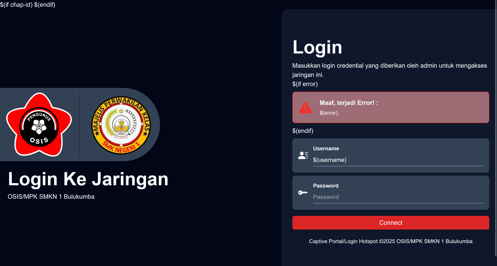

# Captive Portal OSIS/MPK SMKN 1 Bulukumba

## Deskripsi
Repositori ini berisi laman Captive Portal/Login Hotspot untuk router Mikrotik yang digunakan oleh OSIS SMKN 1 Bulukumba.

## Screenshot

# Teknologi Yang Digunakan
- HTML
- TailwindCSS
- JavaScript

## 👥 Kontributor
- [Ade Akbar Magri Dinata](https://github.com/adeak-bar25) - Developer & Desainer

## Lisensi dan Kredit

### Lisensi
Proyek ini dilisensikan di bawah [MIT License](LICENSE).

### Konten Pihak Ketiga
Proyek ini menyertakan logo resmi organisasi OSIS dan MPK dari SMKN 1 Bulukumba yang **bukan bagian dari lisensi MIT**.

Penggunaan logo OSIS dan MPK hanya untuk keperluan internal dan non-komersial.
Seluruh hak atas logo OSIS dan MPK tetap dimiliki oleh pihak yang berwenang.

### Kredit 
#### Icon
Proyek ini juga menggunakan pustaka ikon sumber terbuka berikut:

- **[Google Material Icons](https://fonts.google.com/icons)** – dilisensikan di bawah [Apache License 2.0](https://github.com/google/material-design-icons/blob/master/LICENSE)
- **[Bootstrap Icons](https://icons.getbootstrap.com/)** – dilisensikan di bawah [MIT License](https://github.com/twbs/icons/blob/main/LICENSE)

Ikon digunakan hanya untuk keperluan tampilan UI/UX.

#### Font
Proyek ini menggunakan font **[Plus Jakarta Sans](https://fonts.google.com/specimen/Plus+Jakarta+Sans)**  
yang dirancang oleh **[Tokotype](https://github.com/tokotype/PlusJakartaSans)** dan didistribusikan melalui **[Google Fonts](https://fonts.google.com/)** dengan lisensi [SIL Open Font License 1.1](https://fonts.google.com/specimen/Plus+Jakarta+Sans/license?query=Tokotype).

